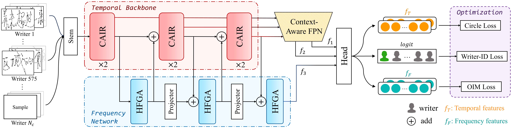

# <div align="center">:dolphin:DOLPHIN

<div align="center">
  <a href="http://dlvc-lab.net/lianwen/"> </a>
  <a href="https://ieeexplore.ieee.org/document/10746457"> </a>
  <a href="https://arxiv.org/abs/2412.11668"> </a>
  
  
<p></p>
  
<a href="https://arxiv.org/abs/2412.11668"> <b>Online Writer Retrieval with Chinese Handwritten Phrases: A Synergistic Temporal-Frequency Representation Learning Approach</b> </a>

<b>IEEE Transactions of Information Forensics and Security (TIFS), 2024</b>

:star:Official code of the DOLPHIN model and the release of the OLIWER dataset.
</div>

## <div align="center">:ocean:Introduction</div>

DOLPHIN is an online writer retrieval model, designed to retrieve all online handwriting samples of a specific writer. It synergizes temporal and frequency learning to extract discriminative feature representations for online handwriting.



<div align="center"><i>The model architecture of DOLPIHN</i></div>

## <div align="center">:earth_asia:Environment</div>

```bash
git clone https://github.com/SCUT-DLVCLab/DOLPHIN.git
conda create -n dolphin python=3.8.16
conda activate dolphin
pip install -r requirements.txt
```

## <div align="center">:hammer_and_pick:Data Preparation</div>

Download the three subsets: CASIA-OLHWDB2, DCOH-E, and SCUT-COUCH2009 using the following links:

- [Baidu Cloud](https://pan.baidu.com/s/1Op917v5IM7OushQ_xPNLSg?pwd=oler)
- [Google Drive](https://drive.google.com/drive/folders/1W-R78wLSJXDhK998c_zIAEFxtPE10AX4?usp=sharing)

Unzip the .zip archives using the following commands:

```bash
unzip OLHWDB2.zip -d .
unzip DCOH-E.zip -d .
unzip COUCH09.zip -d .
```

The directory should look like this:

```
data-raw
├── COUCH09
│   ├── 001
│   └── ...
├── DCOH-E
│   ├── dcoh-e313
│   └── ...
└── OLHWDB2
    ├── 001
    └── ...
```

Then run `preprocess.py` for data preprocessing:

```bash
python preprocess.py --dataset olhwdb2
python preprocess.py --dataset dcohe
python preprocess.py --dataset couch
```

The preprocessed data will be saved at the `data` folder.

Then run the `divide.py` to merge the three subsets into the **OLIWER** dataset and divide the data into `training` and `testing` parts.

```bash
python divide.py --divide
python divide.py --extract
```

Now the data should be all preprocessed. The final data directory should look like:

```bash
data
├── COUCH09
│   └── COUCH09.pkl
├── DCOH-E
│   └── DCOH-E.pkl
├── OLHWDB2
│   └── OLHWDB2.pkl
└── OLIWER
    ├── split.json
    ├── test.pkl
    ├── test-tf.pkl
    ├── train.pkl
    └── train-tf.pkl
```

## <div align="center">:rocket:Test</div>

```
python test.py --weights weights/model.pth
```

## <div align="center">:bookmark_tabs:Citation</div>

```
@ARTICLE{10746457,
  author={Zhang, Peirong and Jin, Lianwen},
  journal={IEEE Transactions on Information Forensics and Security}, 
  title={{Online Writer Retrieval With Chinese Handwritten Phrases: A Synergistic Temporal-Frequency Representation Learning Approach}}, 
  year={2024},
  volume={19},
  number={},
  pages={10387-10399},
```

## <div align="center">:phone:Cotact</div>

Peirong Zhang: eeprzhang@mail.scut.edu.cn

## <div align="center">:palm_tree:Copyright</div>

Copyright 2024, Deep Learning and Vision Computing (DLVC) Lab, South China China University of Technology. [http://www.dlvc-lab.net](http://www.dlvc-lab.net/).

